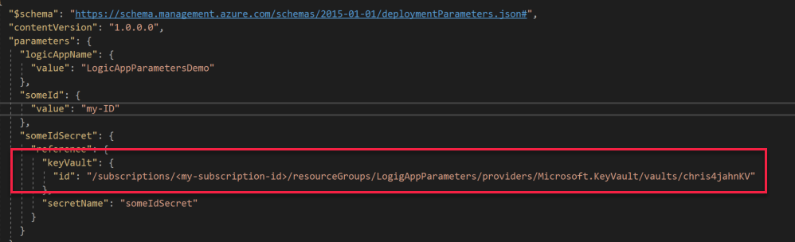

# Using parameters in Azure Logic Apps
I ran into the problem not being able to use parameters within Azure Logic Apps as well as securing them. That's why I started taking a look at the options.
Here are my first suggestions on how to use secured parameters within Logic Apps.

## Define Parameters in the ARM template section
First we need to define our Logic Apps parameters in the default parameters section of our ARM template. 

## Define and parse your parameters to the Logic App
In the Logic App section we first need to define and parse the parameters in the "properties" section.

Now we can parse this information into the "definition" section just defining if it is a SecureString etc.

## Use the parameters in actions etc.
Finally you can now use these parameters in the other sections. e.g. "actions"

## Securely parse the parameters from Azure Key Vault
Ensure that your Key Vault is enabled for ARM template deployment.

Create your secrets in Key Vault

create the Key Vault Parameter in azuredeploy.parameters.json

## Considerations
If you change your secrets within Key Vault, these changes are not synced to your Logic App until you redploy your solution. So changing the settings of your workflow should be done in the ARM template as part of your infrastructure as code (IaC) release pipeline.

THE SOFTWARE OR CODE IS PROVIDED "AS IS", WITHOUT WARRANTY OF ANY KIND, EXPRESS OR IMPLIED, INCLUDING BUT NOT LIMITED TO THE WARRANTIES OF MERCHANTABILITY, FITNESS FOR A PARTICULAR PURPOSE AND NONINFRINGEMENT. IN NO EVENT SHALL THE AUTHORS OR COPYRIGHT HOLDERS BE LIABLE FOR ANY CLAIM, DAMAGES OR OTHER LIABILITY, WHETHER IN AN ACTION OF CONTRACT, TORT OR OTHERWISE, ARISING FROM, OUT OF OR IN CONNECTION WITH THE SOFTWARE/SCRIPTS OR THE USE OR OTHER DEALINGS IN THE SOFTWARE/SCRIPTS.
